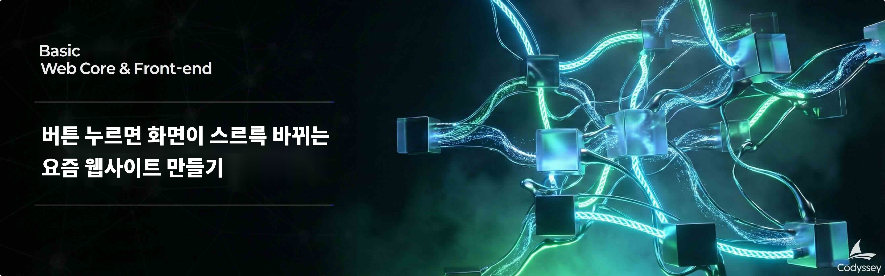

# B4-2: 버튼 누르면 화면이 스르륵 바뀌는 요즘 웹사이트 만들기

## 📋 과제 정보

| 항목 | 내용 |
|------|------|
| **분야** | AI/SW 기초 |
| **과목** | 웹 기초와 프론트엔드 |
| **난이도** | ★★☆ (Lv.2) |
| **학습 시간** | 80시간 |
| **필수 여부** | 🔵 선택 |
| **진행 상태** | 동료평가 준비 |
| **과제 번호** | 185011 |

---

## 🎯 미션 소개

B4-1에서 순수 HTML/CSS/JavaScript로 "이벤트 → 상태 → 렌더링" 흐름을 배웠다면, 이번에는 **React 프레임워크**로 그 흐름을 구조화한다. 컴포넌트 분리, 상태 관리, 라우팅, 비동기 데이터 처리까지 — React로 만드는 CRUD 웹앱의 전체 사이클을 경험한다.

버튼을 누르면 화면이 스르륵 바뀌는 "요즘 웹사이트"처럼, 페이지 전환과 데이터 갱신이 부드럽게 일어나는 SPA(Single Page Application)를 만드는 것이 목표다.

---

## 🎓 학습 목표

이 과제를 완료한 뒤, 다음을 설명할 수 있어야 한다:

1. **React 컴포넌트 구조** — 페이지/컴포넌트/훅을 분리하여 설계하는 방법
2. **상태 관리** — useState/useEffect로 데이터 로드 → 화면 반영 흐름
3. **라우팅** — React Router로 페이지 간 이동 (최소 5개 라우트)
4. **비동기 렌더링** — 로딩/에러/빈 데이터 상태를 일관되게 처리
5. **데이터 흐름** — 이벤트 → 상태 변경 → API 호출 → 렌더링 전체 사이클
6. **BaaS 연동** — Supabase 또는 Firebase로 백엔드 없이 데이터 CRUD

---

## 📦 최종 결과물

1. **GitHub 저장소 URL** — 소스 코드 (.env 제외, README 포함)
2. **배포된 사이트 URL** — Vercel/Netlify 등에 배포, CRUD 동작 확인

---

## ✅ 기능 요구사항

### 라우팅 (최소 5개)
| 라우트 | 기능 |
|--------|------|
| `/items` | 목록 조회 (카드 리스트 + 로딩 스피너) |
| `/items/:id` | 상세 조회 |
| `/items/new` | 등록 (폼 작성 → 저장 → 목록/상세 이동) |
| `/items/:id/edit` | 수정 |
| `*` | 404 Not Found |

### CRUD
- 목록 조회, 상세 조회, 등록, 수정, 삭제 모두 정상 동작

### 상태 처리 (모든 핵심 화면에서 일관된 방식)
| 상황 | 표시 |
|------|------|
| 로딩 중 | 스피너 |
| 빈 데이터 | "표시할 데이터가 없습니다." |
| 에러 | "요청에 실패했습니다. 다시 시도하세요." |

### 폼 검증
- 필수값 검증, 에러 메시지 표시, 제출 중 상태 표시(disabled)

### 구조 분리
- **pages/components/hooks(또는 lib)** 폴더 분리
- 최소 8개 이상의 재사용 컴포넌트
- 최소 1개 이상의 커스텀 훅 (분리 이유 설명 가능)

---

## 🛠️ 개발 환경

- React 18 이상

---

## ⚠️ 제약 사항

### 프레임워크
- **React 기반**으로 구현 (다른 프레임워크 금지)
- 핵심 목표: React의 컴포넌트/상태/이벤트/비동기 렌더링 학습이 중심

### 백엔드
- **Supabase 또는 Firebase** 사용
- 백엔드 고급 기능(권한/RLS/Rules, 복잡한 관계 설계)은 **필수 아님**
- 백엔드 서버를 직접 구현하는 방식은 **요구하지 않음**

### 구조
- 라우팅이 존재해야 함
- 페이지/컴포넌트/훅(또는 lib)이 분리되어야 함

### 기능 범위
- UI 고퀄리티보다 **"React 구조와 데이터 흐름"**이 우선

### 언어 및 스타일링
- TypeScript 사용은 **선택 사항** (가산점 없음)
- 스타일링 방식 자유 (순수 CSS, Tailwind, CSS-in-JS, UI 라이브러리 등)
- 반응형 디자인은 **선택 사항**

### 환경변수 및 보안
- API Key 등 민감 정보는 `.env` 파일에 저장, `.gitignore`에 `.env` 포함
- API Key가 포함된 코드를 GitHub에 **절대 푸시하지 않음**
- 배포 시 Vercel/Netlify 대시보드에서 Environment Variables 별도 등록

---

## 📝 결과 예시

아래는 정답이 아니라 참고 예시다. 실제 문구, 디자인은 얼마든지 달라도 된다.

- `/items`에서 카드 리스트가 보이고, 로딩 중에는 스피너가 보인다
- 리스트 항목 클릭 시 `/items/123`로 이동하고 상세가 뜬다
- `/items/new`에서 폼을 작성하고 저장하면 목록 또는 상세로 이동한다
- 빈 데이터면 "표시할 데이터가 없습니다."가 보인다
- 에러면 "요청에 실패했습니다. 다시 시도하세요."가 보인다

---

## 📊 평가 정보

- 평가 대상: 예
- 평가 방식: 동료 평가 (3명, 랜덤 배정, 30분)

### 평가 항목 (루브릭)

**항목 1: 기능 동작**
- 최소 5개 이상의 라우트 + Not Found 페이지
- 목록/상세/등록/수정/ 삭제 모두 정상 동작
- 로딩/에러/빈 상태가 모든 핵심 화면에서 일관된 방식
- 폼 필수값 검증, 에러 메시지, 제출 중 상태 표시
- 배포된 URL에서 CRUD 포함 모든 기능 정상 동작

**항목 2: 구조/설계**
- 데이터 조회/갱신 흐름 중 최소 1개 이상이 커스텀 훅으로 분리 + 분리 이유 설명
- pages, components, hooks(또는 lib) 폴더 분리 + 구조 선택 이유 설명
- 최소 8개 이상의 재사용 컴포넌트 + 분리 기준 구체적 설명
- 로딩/에러/빈 상태 UI가 공통 컴포넌트로 통일
- 커스텀 훅 분리 이유 설명

**항목 3: React 개념 이해**
- props와 state의 차이 구분 + 상태 위치 흐름 설명
- useEffect 실행 시점 + 의존성 배열 역할 설명
- 비동기 데이터 요청 시 로딩/성공/실패/빈 상태 처리 방식 설명
- 상태 변경이 화면 변화로 이어지는 지점 3군데 이상 설명

**항목 4: 통합 설명**
- 라우팅 → 컴포넌트 → 상태 → 이벤트 → 렌더링 흐름 설명
- Supabase/Firebase 선택 이유 + 연동 어려움 구체적 설명

**항목 5: 보너스**
- 보너스 문제 해결에 따른 크레딧 부여

---

> *이 문서는 Codyssey AI/SW 기초 과정의 과제 내용을 기반으로 작성되었습니다.*
